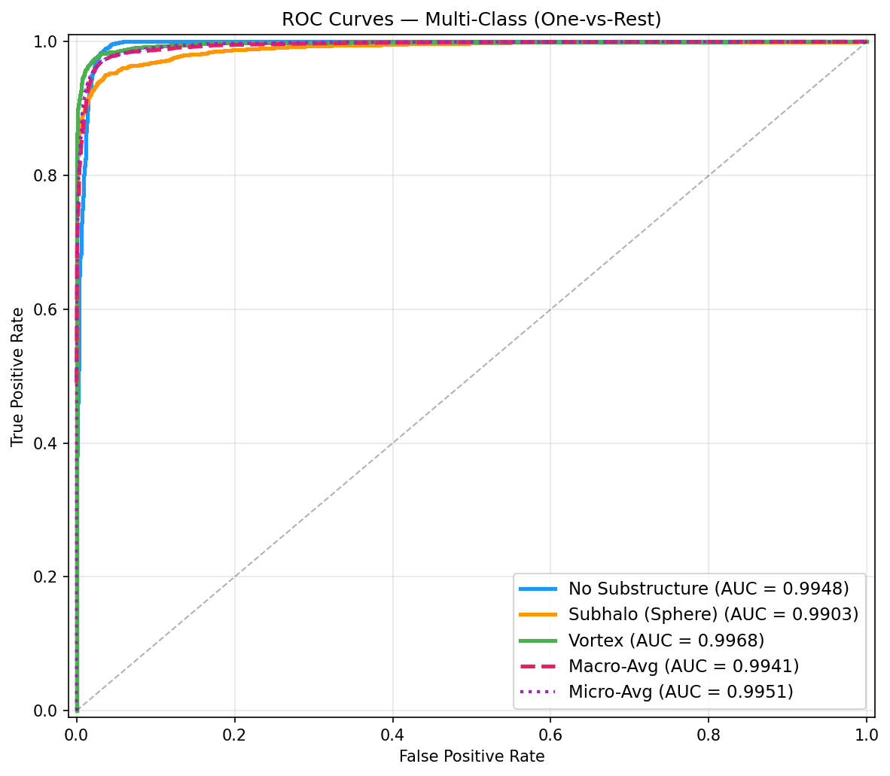
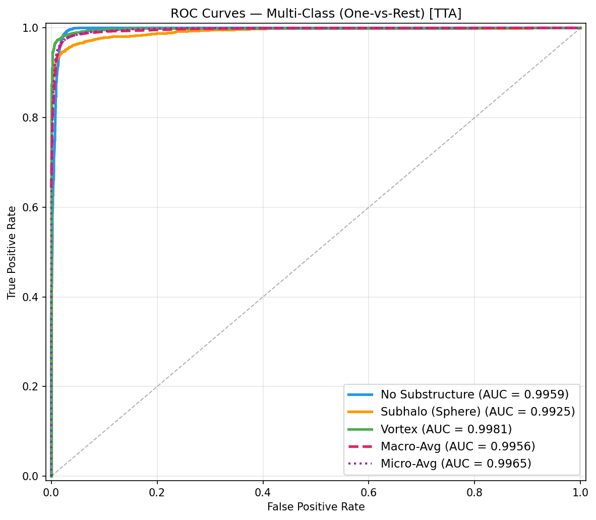
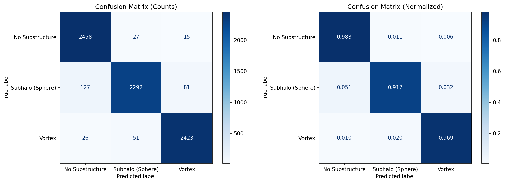
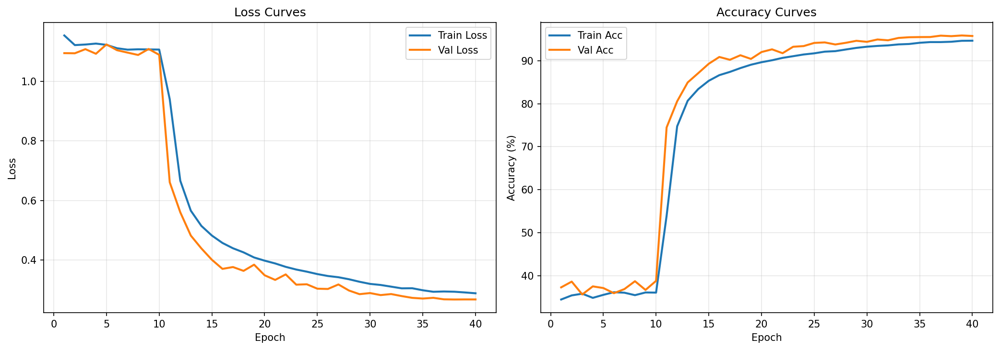
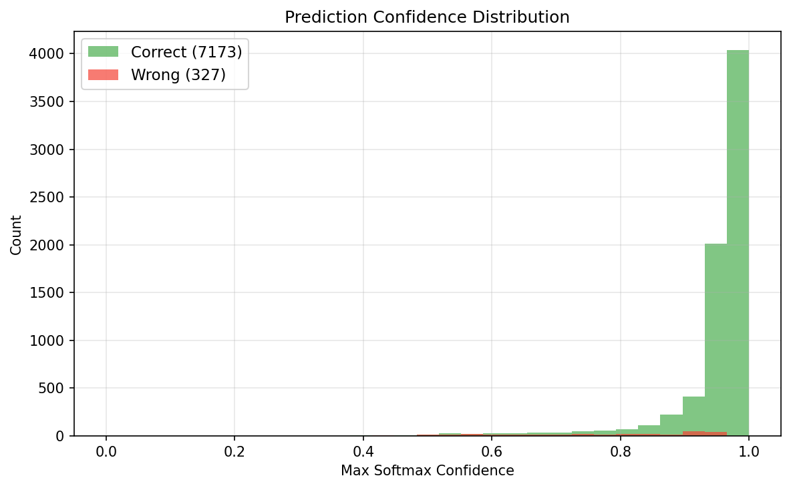

# Common Test I: Multi-Class Classification

Classify strong gravitational lensing images into three classes: no substructure, CDM subhalo (sphere), and axion vortex.

## Results

| Metric | No TTA | 8x TTA |
|---|---|---|
| Accuracy | 95.64% | **96.51%** |
| No substructure AUC | 0.9948 | 0.9959 |
| Subhalo (sphere) AUC | 0.9903 | 0.9925 |
| Vortex AUC | 0.9968 | 0.9981 |
| Macro AUC | 0.9941 | **0.9956** |
| Micro AUC | 0.9951 | **0.9965** |

All metrics computed on the held-out validation set (10% split, 7500 images).







## Why this problem is harder than it looks

The three lensing classes have mean-image pixel correlations >0.999 with each other. A KNN classifier on raw pixels scores ~34% (random chance). Even a CNN trained from scratch converges slowly and plateaus early — the perturbations from dark matter substructure are too subtle and spatially diffuse for random-initialized filters to pick up in reasonable time.

## Approach

**Log-stretch preprocessing**: Before anything else I apply `log1p(x * 10) / log1p(10)` to the pixel values. The raw images are min-max normalized into [0,1] but the Einstein ring dominates the brightness. This transform compresses the bright core and amplifies the faint outer region where substructure signatures actually sit — roughly 6× sensitivity boost in the dim-pixel regime. This single preprocessing step is the biggest single driver of performance.

**Transfer learning with ResNet-18**: ImageNet pretrained weights give the network edge and texture detectors from day one. These transfer well to lensing images because substructure manifests as subtle spatial irregularities in the arc morphology.

**Two-phase training**:
- Phase 1 (10 epochs): backbone frozen, only the classification head trains with AdamW lr=1e-3 and StepLR halving every 5 epochs. This avoids destroying the pretrained representations before the head has stabilized.
- Phase 2 (30 epochs): all layers unfrozen with differential learning rates — head at 1e-3, backbone at 1e-4 — with cosine annealing to 1e-7. The low backbone lr allows the filters to adapt to lensing images without overwriting the ImageNet features.

Mixed precision (AMP) is used in `train.py` for ~2× speed on CUDA.

**Augmentation**: Random horizontal/vertical flips, 90°/180°/270° rotations, and Gaussian noise (σ=0.05). Gravitational lensing has no preferred orientation, so full rotation and reflection symmetry is physically motivated.

**Test Time Augmentation**: At inference, each image is passed through 8 geometric variants (identity, two flips, three rotations, two flip+rotation combos). Softmax outputs are averaged and argmax is taken. This gives +0.87pp over single-pass inference at no training cost.

## Overfitting analysis

Validation accuracy *exceeds* training accuracy throughout the full 40-epoch run, with a final train–val gap of −1.1% (val better than train). This is the expected behaviour when augmentation is applied only to the training set — training is genuinely harder. Val loss likewise stays consistently below train loss. There is no sign of overfitting. The model generalizes cleanly, which is partly a credit to the strong augmentation and partly to label smoothing reducing overconfident predictions.

The hardest class is subhalo (AUC 0.9903), which makes physical sense: CDM subhalos produce localized, sometimes faint perturbations that are more easily confused with noise, whereas axion vortices leave a more extended and distinctive ring-like imprint.

## Files

```
Common_Test_I/
├── Test1_MultiClass_Classification.ipynb   # full pipeline, executed with outputs
├── requirements.txt
├── weights/
│   └── best_model.pth                      # ResNet-18, best epoch (95.64% val acc)
├── plots/
│   ├── roc_curves.png
│   ├── roc_curves_tta.png
│   ├── confusion_matrix.png
│   ├── confidence_analysis.png
│   ├── training_curves.png
│   └── data_analysis.png
└── src/
    ├── train.py                            # standalone training script (with AMP)
    └── evaluate.py                         # full evaluation + plot generation
```

## Reproducing the results

Download the dataset from the provided Google Drive link and extract so the layout is:

```
Common_Test_I/dataset/dataset/
├── no/
├── sphere/
└── vort/
```

```bash
pip install -r requirements.txt

# train from scratch (~45 min on a mid-range GPU with AMP)
python src/train.py

# evaluate and regenerate all plots
python src/evaluate.py
```

Or open `Test1_MultiClass_Classification.ipynb` — it walks through the full pipeline from dataset exploration to TTA evaluation with inline plots.
